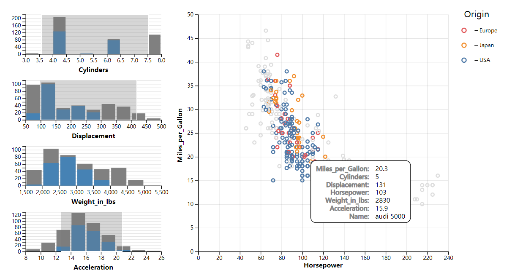

Cross-Filter Among Multiple Histograms
===

<!--  -->


:book: Introduction
---

Add brush interaction to Multipule Histograms. Brushing on each histogram will influence all of them. In other words, the brushes on each histogram can work together to filter data.

:bulb: Key Points
---

1. The render funtion of histogram will return an update function: ```filterData```. It accept an ```filterExtends``` parameter, and will update the histogram according to the ```filterExtends```.

  ```js
  function renderBinnedChart(root, width, height, data, key, setFilterExtent) {

      // ......

      function filterData(filterExtents){
          barsFiltered
              .attr("y", d => {
                  d = d.filter(d => {
                      for(const key in filterExtents) {
                         const extent = filterExtents[key]; 
                         if(extent && (d[key] < extent[0] || d[key]>extent[1])) return false;
                      }
                      return true;
                  })
                  return scaleY(d.length)
              })
              .attr("height", d => {
                  d = d.filter(d => {
                      for(const key in filterExtents) {
                         const extent = filterExtents[key]; 
                         if(extent && (d[key] < extent[0] || d[key]>extent[1])) return false;
                      }
                      return true;
                  })
                  return scaleY(0) - scaleY(d.length)
              });
      }

      return filterData;
  }
  ```

2. ```createExtent``` is the most part of the cross-filter interaction. When the ```filterExtents``` changes, the update functions of all the histograms will be called. It create ```filterExtents``` which depends on given update functions. If you use ```setFilterExtent``` to update ```filterExtents```, the new ```filterExtends``` will be passed to all the update functions it depends on, thereby update the histograms.

  ```js
  /**
   * @param {([key: string]: (extent: [number, number]) => void)[]} updateFuncs A updateFunc is functions to update . When brushed on the charts, filterExtents will passed to the updateFuncs;
   */
  function createExtent(updateFuncs={}){
      const filterExtents = {}; // e.g. {'Cylinder': [0, 8], 'Displacement': undefined}

      function setFilterExtent(key, value) {
          filterExtents[key] = value;
          for(const key in updateFuncs) {
              updateFuncs[key](filterExtents);
          }
      }

      return [filterExtents, setFilterExtent];
  }
  ```

3. When you click at an unbrushed area, the brush will disappeared, and the selection passed to the ```brushed``` function will be undefined. In this situation, we should set the ```filterExtent``` according to the specified histogram to undefined, and update all of the histograms.

```javascript
  function renderBinnedChart(root, width, height, data, key, setFilterExtent) {
    // ......

    const brush= d3.brushX()
        .extent([[0, 0], [width, height]])
        .on("brush end", brushed); // "end" to capture the event that click but not drag.
    brush(groupPlot);

    function brushed(e) {
        const { selection } = e;
        if(selection) {
            setFilterExtent(key, [scaleX.invert(selection[0]), scaleX.invert(selection[1])]);
        } else { // reset
            setFilterExtent(key)
        }
    }

    // ......
  }
```

